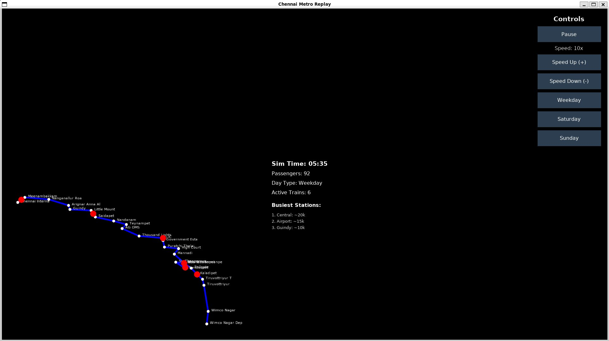

# Chennai Metro Replay 🚇

A real-time simulation and replay system for Chennai Metro's Blue Line, visualizing train movements, passenger flow, and operational patterns based on actual CMRL timetables and ridership data.


## 📋 Table of Contents
- [Features](#features)
- [Preview](#preview)
- [Installation](#installation)
- [Usage](#usage)
- [Controls](#controls)
- [Data Sources](#data-sources)
- [Technical Details](#technical-details)
- [Roadmap](#roadmap)
- [Contributing](#contributing)

## ✨ Features

### Real-Time Simulation
- **Live train tracking**: Watch trains move along the entire Blue Line from Wimco Nagar Depot to Chennai International Airport
- **26 stations**: All Blue Line stations with accurate geographic positioning
- **Dynamic scheduling**: Realistic train frequencies based on time of day and day type

### Historical Data Integration
- **Ridership statistics**: Based on actual CMRL monthly ridership data (2023-2024)
- **Peak hour patterns**: Rush hour frequencies (6-min intervals) vs off-peak (7-15 min)
- **Day type variations**: Different schedules for Weekdays, Saturdays, and Sundays

### Interactive Controls
- ⏯️ **Play/Pause**: Control simulation flow
- ⚡ **Speed control**: Adjust replay speed from 10x to 240x
- 📅 **Day type selection**: Switch between Weekday, Saturday, and Sunday schedules
- ⌨️ **Keyboard shortcuts**: Quick access to common functions

### Visual Analytics
- **Station overview**: Top 3 busiest stations displayed
- **Real-time metrics**: Active trains, passenger count, and current simulation time
- **Color-coded visualization**: Blue metro line, white stations, red trains

## 🖼️ Preview



### Main Application Interface

The application features a clean, dark-themed interface with a diagonal metro line layout showing the actual geographic orientation of Chennai's Blue Line from north to south.

### Key Visual Elements

**🔵 Blue Line Path**: 
- Diagonal layout matching real geographic positioning
- Connects all 26 stations from Wimco Nagar Depot (bottom-right) to Chennai International Airport (top-left)
- Smooth blue line with white station dots

**⚪ Station Markers**: 
- White/blue circular dots at each station location
- Station names labeled next to each marker
- Clear visibility of all 26 stations

**🔴 Train Markers**: 
- Large red circles showing active train positions
- Multiple trains visible simultaneously during operation
- Smooth movement along the line path

**📊 Center Information Panel**: 
Displays real-time statistics:
- **Sim Time**: Current time in simulation (HH:MM format)
- **Passengers**: Cumulative passenger count
- **Day Type**: Current schedule (Weekday/Saturday/Sunday)
- **Active Trains**: Number of trains currently running
- **Busiest Stations**: Top 3 stations by ridership

**🎮 Right-Side Control Panel**: 
Vertical button layout with:
- **Pause/Play** button (blue-gray)
- **Speed indicator** (e.g., "Speed: 10x")
- **Speed Up (+)** button
- **Speed Down (-)** button
- **Weekday** button
- **Saturday** button
- **Sunday** button

### Application Layout
```
┌─────────────────────────────────────────────────────────────────────────┐
│                        Chennai Metro Replay                              │
├─────────────────────────────────────────────────────────────────────────┤
│                                                            ┌──────────┐  │
│                                                            │ Controls │  │
│                                                            ├──────────┤  │
│  ● Wimco Nagar Depot                                      │  Pause   │  │
│   ╲                                                        │Speed: 10x│  │
│    ● Wimco Nagar                                          │Speed Up  │  │
│     ╲              Sim Time: 05:35                        │Speed Down│  │
│      ● Tiruvottriyur                                      │ Weekday  │  │
│       ╲            Passengers: 92                         │ Saturday │  │
│        ⬤ [TRAIN]   Day Type: Weekday                      │  Sunday  │  │
│         ╲          Active Trains: 6                       └──────────┘  │
│          ● Tondiarpet                                                    │
│           ╲        Busiest Stations:                                     │
│            ● Sir Theagaraya                                              │
│             ╲      1. Central: ~20k                                      │
│              ● Washermanpet   2. Airport: ~15k                           │
│               ╲                3. Guindy: ~10k                           │
│                ⬤ [TRAIN]                                                 │
│                 ╲                                                        │
│                  ● High Court                                            │
│                   ╲                                                      │
│                    ● Puratchi Thalaivar (MGR Central)                    │
│                     ╲                                                    │
│                      ● Government Estate                                 │
│                       ╲                                                  │
│  ● Chennai Airport    ● LIC                                             │
│   (Terminus)           ╲                                                 │
│                         ● Thousand Lights                                │
│                          ╲                                               │
│                           ● Teynampet                                    │
│                            ╲                                             │
│                             ● Nandanam                                   │
│                              ╲                                           │
│                               ● Saidapet                                 │
│                                ╲                                         │
│                                 ● Little Mount                           │
│                                  ╲                                       │
│                                   ● Guindy                               │
│                                    ╲                                     │
│                                     ● Arignar Anna Alandur               │
│                                      ╲                                   │
│                                       ● Nanganallur Road                 │
│                                        ╲                                 │
│                                         ● Meenambakkam                   │
└─────────────────────────────────────────────────────────────────────────┘
```

## 🚀 Installation

### Prerequisites
```bash
Python 3.8 or higher
pip (Python package manager)
```

### Step 1: Clone the Repository
```bash
git clone https://github.com/aragulkumar/chennai-metro-replay.git
cd chennai-metro-replay
```

### Step 2: Create Virtual Environment (Recommended)
```bash
python -m venv venv

# On Linux/Mac:
source venv/bin/activate

# On Windows:
venv\Scripts\activate
```

### Step 3: Install Dependencies
```bash
pip install arcade
```

### Step 4: Run the Simulation
```bash
python chennai_metro_replay_pure_arcade.py
```

## 🎮 Usage

### Basic Operation

1. **Launch the application**
   ```bash
   python chennai_metro_replay_pure_arcade.py
   ```

2. **Control the simulation**
   - The simulation starts automatically in **Weekday** mode
   - Trains begin departing from 5:00 AM
   - Click **Pause** to stop, **Play** to resume

3. **Adjust replay speed**
   - Use **Speed Up** and **Speed Down** buttons
   - Or press **↑** and **↓** arrow keys
   - Range: 10x to 240x real-time speed

4. **Change day type**
   - Click **Weekday**, **Saturday**, or **Sunday** buttons
   - Simulation will reset to 5:00 AM with new schedule

### Advanced Features

**Keyboard Shortcuts:**
- `SPACE`: Toggle Play/Pause
- `↑`: Increase speed
- `↓`: Decrease speed

**Simulation Time:**
- Runs from 5:00 AM to 11:00 PM (18 hours of operation)
- Can be sped up to complete a full day in minutes
- Passenger accumulation reflects historical ridership patterns

## 🎛️ Controls

### Button Controls

| Button | Function |
|--------|----------|
| **Pause/Play** | Toggle simulation state |
| **Speed Up (+)** | Increase replay speed by 10x |
| **Speed Down (-)** | Decrease replay speed by 10x |
| **Weekday** | Switch to weekday schedule (6-7 min intervals) |
| **Saturday** | Switch to Saturday schedule (10-14 min intervals) |
| **Sunday** | Switch to Sunday schedule (10-15 min intervals) |

### Keyboard Controls

| Key | Function |
|-----|----------|
| `SPACE` | Toggle Play/Pause |
| `↑` | Increase speed |
| `↓` | Decrease speed |

## 📊 Data Sources

### Station Data
- **26 Blue Line stations** with geographic coordinates
- Data sourced from:
  - Chennai Metro Rail Limited (CMRL) official route maps
  - OpenStreetMap
  - Wikipedia Chennai Metro articles

### Ridership Data
- Historical monthly ridership from April 2023 onwards
- Example data points:
  - Apr 2023: 4,377,813 passengers
  - May 2023: ~4,500,000 passengers
- Scaled to daily and hourly estimates for simulation

### Train Schedules
Based on CMRL timetables (February 2026):

**Weekday:**
- Peak hours (8-11 AM, 5-8 PM): 6-minute intervals
- Normal hours: 7-minute intervals
- Late night (10-11 PM): 15-minute intervals

**Saturday:**
- Afternoon/Evening (12-8 PM): 10-minute intervals
- Other times: 14-minute intervals

**Sunday:**
- Afternoon/Evening (12-8 PM): 10-minute intervals
- Other times: 15-minute intervals

## 🔧 Technical Details

### Architecture
```
MetroSimulation (arcade.Window)
├── Metro Line Rendering
│   ├── Station positioning (lat/lon to screen coords)
│   ├── Line drawing (blue path)
│   └── Station markers (white circles)
├── Train System
│   ├── Train generation (schedule-based)
│   ├── Position interpolation
│   └── Visual rendering (red circles)
├── Statistics Engine
│   ├── Passenger accumulation
│   ├── Station metrics
│   └── Real-time calculations
└── UI System (arcade.gui)
    ├── Control panel
    ├── Info display
    └── Event handling
```

### Key Components

**Coordinate Scaling:**
```python
def scale_coords(coords, width=700, height=500, margin=50):
    # Min-max normalization of lat/lon to screen coordinates
    # Maintains relative geographic positioning
    # Inverts Y-axis for north-south orientation
```

**Train Generation:**
```python
def generate_trains(day_type, start_time, end_time):
    # Creates trains based on:
    # - Day type (weekday/saturday/sunday)
    # - Time of day (peak/normal/late)
    # - CMRL frequency guidelines
```

**Simulation Update:**
- Delta-time based animation (60 FPS target)
- Time-scaled progression (configurable speed)
- Continuous passenger accumulation
- Smooth train interpolation between stations

### File Structure
```
chennai-metro-replay/
├── chennai_metro_replay_pure_arcade.py  # Main application
├── README.md                            # This file
├── requirements.txt                     # Python dependencies
├── screenshots/                         # Preview images
│   ├── main_view.png
│   ├── peak_hours.png
│   └── controls.png
└── data/                                # Optional: Extended data files
    ├── ridership.json
    └── timetables.json
```

## 🗺️ Roadmap

### Planned Features

**Version 2.0:**
- [ ] Green Line integration (Central to St. Thomas Mount)
- [ ] Interchange station highlighting
- [ ] Station-wise passenger boarding/alighting
- [ ] Real-time delay simulation

**Version 2.5:**
- [ ] 3D visualization mode
- [ ] Heat map of passenger density
- [ ] Historical replay from actual operational data
- [ ] Export simulation data to CSV/JSON

**Version 3.0:**
- [ ] Multi-line system (Blue + Green + future extensions)
- [ ] Network graph analytics
- [ ] Predictive modeling
- [ ] API for external data integration

### Known Issues
- Train count may not exactly match real operations (simplified model)
- Passenger distribution is uniform across stations (actual data varies)
- No breakdown/delay simulation yet
- Limited to single direction per train

## 🤝 Contributing

Contributions are welcome! Here's how you can help:

### Reporting Bugs
- Use GitHub Issues
- Include error messages, screenshots
- Describe steps to reproduce

### Suggesting Features
- Open a GitHub Issue with [Feature Request] tag
- Describe the feature and its use case
- Share any relevant data sources

### Code Contributions
1. Fork the repository
2. Create a feature branch (`git checkout -b feature/AmazingFeature`)
3. Commit your changes (`git commit -m 'Add some AmazingFeature'`)
4. Push to the branch (`git push origin feature/AmazingFeature`)
5. Open a Pull Request

### Data Contributions
We especially welcome:
- Updated ridership statistics
- More accurate station coordinates
- Real timetable data
- Green Line information

## 📝 License

This project is licensed under the MIT License - see the [LICENSE](LICENSE) file for details.

## 🙏 Acknowledgments

- **Chennai Metro Rail Limited (CMRL)** for public timetable and ridership data
- **Arcade Library** for the Python game framework
- **OpenStreetMap** contributors for geographic data
- Chennai metro commuters for inspiration

## 📧 Contact

**Project Maintainer:** Ragul
- GitHub: [@aragulkumar](https://github.com/yourusername)
- Email: your.email@example.com

**Project Link:** [https://github.com/aragulkumar/chennai-metro-replay](https://github.com/yourusername/chennai-metro-replay)

---

## 🎯 Quick Start

```bash
# One-command setup and run
git clone https://github.com/aragulkumar/chennai-metro-replay.git
cd chennai-metro-replay
python -m venv venv && source venv/bin/activate
pip install arcade
python chennai_metro_replay_pure_arcade.py
```

**Enjoy simulating Chennai Metro! 🚇✨**

---

*Last Updated: February 2026*
*Version: 1.0.0*